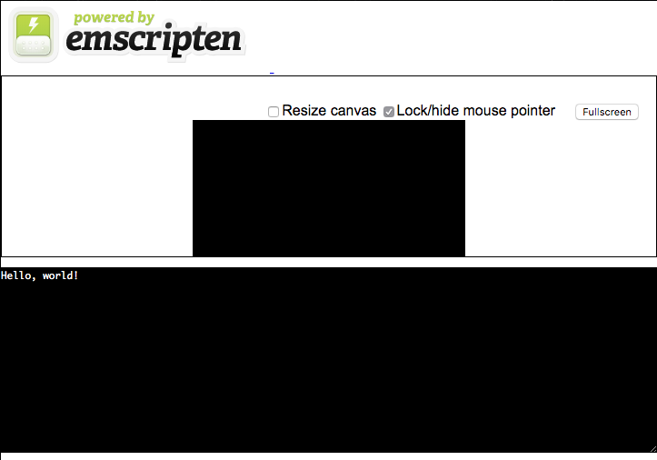
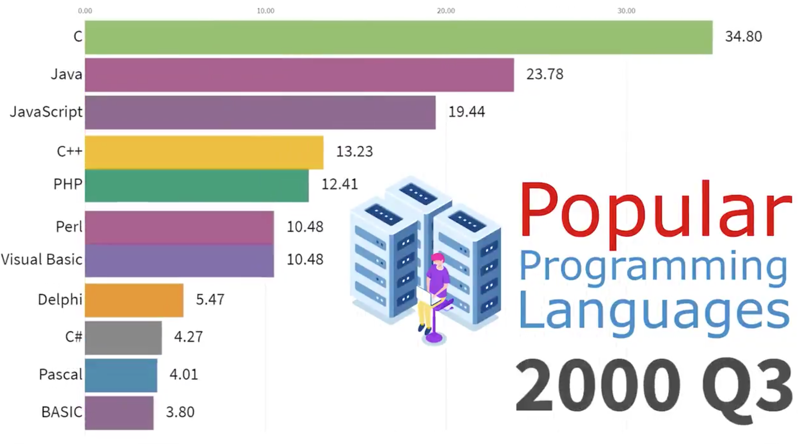
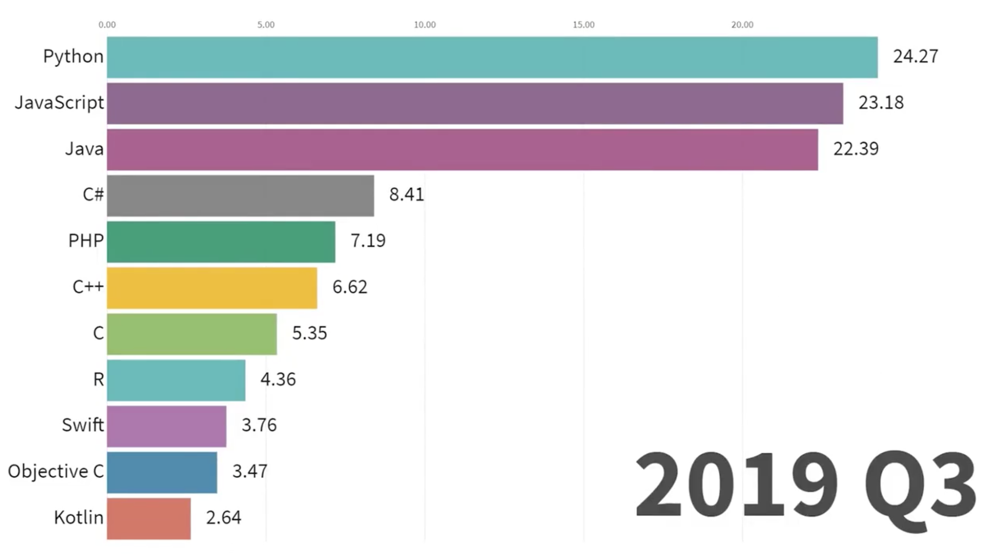
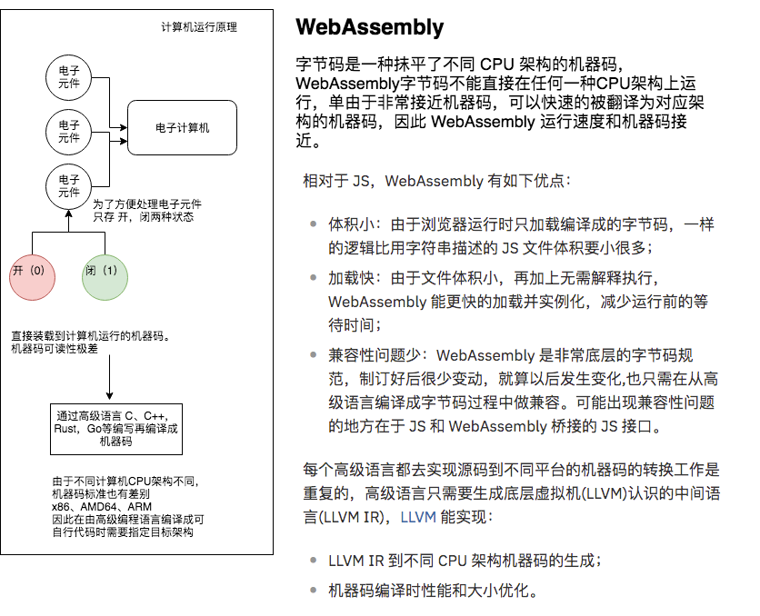

# webAssembly 初探

> 就在昨天，技术部开了一个分享会，说到了 WebAssembly，说它是一个新的语言，未来可能代替 Javascript 的，我表示怀疑。接下来，一起是了解一下这个神奇的语言吧。（结论：WebAssembly 并不是一门编程语言，而是一份字节码标准。可以将C/C++ 甚至TS直接编译成wasm格式的文件，被js引用。和Javascript可以实现相互协同的作用，可以共生共存共荣。）

## Mac OS 安装
通过 shell终 端安装SDK。可以通过Gihhub轻松获得用于将C/C++编译为WebAssembly的预编译工具链
```
$ git clone https://github.com/emscripten-core/emsdk.git
$ cd emsdk
$ ./emsdk install latest
$ ./emsdk activate latest
```

## 安装后的环境设置
安装或编译SDK后，安装完成，要在下载预编译的工具链或构建自己的工具链后在当前命令行提示符中输入Emscripten编译器环境
```
$ source ./emsdk_env.sh --build=Release
```

## 编译并运行一个简单的程序
我们现在有一个完整的工具链，我们可以使用它来编译一个简单的程序到WebAssembly。但是，还有一些警告：

* 我们必须链接标志传递-s WASM=1到emcc（否则默认情况下emcc将编译成asm.js）。
* 如果我们希望Emscripten生成一个运行我们程序的HTML页面，那么除了Wasm二进制文件和JavaScript包装器之外，我们还必须指定一个带.html扩展名的输出文件名。
* 最后，为了实际运行程序，我们不能简单地在Web浏览器中打开HTML文件，因为file协议方案不支持跨源请求。我们必须通过HTTP实际提供输出文件。

下面的命令将创建一个简单的“hello world”程序并进行编译。
```
$ mkdir hello
$ cd hello
$ cat << EOF > hello.c
#include <stdio.h>
int main(int argc, char ** argv) {
  printf("Hello, world!\n");
}
EOF
$ emcc hello.c -s WASM=1 -o hello.html
```

> 运行之后，使用 http-server 访问 hello.html 页面，可以看到 命令行框中打印处理 Hello, world! 的字样。如下图



完整文档：[https://wasm.comptechs.cn/docs/DevelopersGuide.html](https://wasm.comptechs.cn/docs/DevelopersGuide.html)

## 如何将 Typescript 编译成 WebAssembly

Javascript 固有的特质就是，只有想不到，没有做不到。一切可能的尝试，Javascript 都会孜孜不倦的探索和尝试。
目前新出的可以将 ts 编译成 WebAssembly 的方式是可以使用 TypeScript 的子集 Assemblyscript

下面的命令将创建一个简单的“as hello world”程序并进行编译。
```
$ mkdir ts
$ cd ts
$ cat fib.ts
export function fib(n: i32): i32 {
  var a = 0, b = 1;
  for (let i = 0; i < n; i++) {
    let t = a + b; a = b; b = t;
  }
  return b;
}
$ asc fib.ts -b fib.wasm -O3
```

## 安装 Assemblyscript
```
$ npm install assemblyscript
$ npx asinit .
```

安装 assemblyscript 依赖，然后自动生成相关的文件目录

执行编译命令
````
asc fib.ts -o fib.wasm
````
该命令将ts代码编译成可运行的 WebAssembly 模块
为了加载执行该文件，可以通过 js中的加载模块，或是异步加载的方式导入项目来。

完整文档：[https://docs.assemblyscript.org/quick-start](https://docs.assemblyscript.org/quick-start)

## 为什么出现了 WebAssembly
JavaScript 自从诞生起到现在已经变成了非常流行的语言





完整视频地址：[/data/js-history.mp4]

自2000年到现在 Javascript 稳居前三。这离不开Web的发展和网络环境的发展所推动。Web应用变得更多更复杂了之后，也渐渐暴露出了很多问题
* 语法态灵活，导致大型项目开发困难
* 性能不能满足一些场景需要

针对上面问题，出现了js的替代语言

厂商 | 语言 | 解决问题 | 尚存在问题
--: | ---: | ---: | ---:
微软 | TypeScript | 通过为 JS 加入静态类型检查来改进 JS松散的语法，提升代码健壮性 | 仅仅解决了语法松散问题，还需要编译成js，对性能没有提升
谷歌 | Dart | 为浏览器引入新的虚拟机去直接运行 Dart程序以提升性能 | 只能在Chrome预览版本中运行，5⃣️主流浏览器支持
火狐 | asm.js | 取JS的子集，JS引擎针对asm.js 做性能优化 | 语法太简单，有很大的限制，开发效率低

以上互不兼容的情况，催生了 WebAssembly 的诞生，WebAssembly 是一种新的字节码格式，主流浏览器都已经支持。和JS需要解释执行不同的是，WebAssembly 字节码和底层机器码很相似可快速装载运行，因此性能相对于JS解释执行大大提升。也就是说WebAssemably并不是一门编程语言，而是一份字节码标准，需要用高级编程语言编译出字节码放到 WebAssembly 虚拟机中才能运行，浏览器厂商需要做的就是根据 WebAssembly 规范实现虚拟机。

## WebAssembly 原理


## 能编译成 WebAssembly字节码的高级语言
[LLVM 底层虚拟机（Low Level Virtual Machine）](https://zh.wikipedia.org/wiki/LLVM) 还实现了 LLVM IR 到 WebAssembly 字节码的编译功能，也就是说只要该机语言能转换成 LLVM IR，就能被编译成 WebAssembly 字节码

高级语言 | 学习难度 | 文档
--: | ---: | ---:
AssemblyScript 语法 | 和TS一致，对于前端来说学习成本低 | [文档地址](https://docs.assemblyscript.org/)
c\c++ | 官方推荐 | [文档地址](http://webassembly.org.cn/getting-started/developers-guide/)
Rust | 语法复杂，学习成本高 | [文档地址](https://github.com/rust-lang-nursery/rust-wasm)
Kotlin | 语法和java，js详细，语言学习成本低 | [文档地址](https://kotlinlang.org/docs/reference/native-overview.html)
Golang | 语法简单学习成本低 | [文档地址](https://blog.gopheracademy.com/advent-2017/go-wasm/)

## AssemblyScript 的实现原理
AssemblyScript也借助了 LLVM，通过TypeScript编译器把 TS 源码解析成 抽象语法树（AST），再把AST编译成IR，再通过 LLVM 编译成 WebAssembly 字节码实现。AS比TS存在很多限制：

* 比 TS 多了很多更细致的内置类型，以优化性能和内存占用
* 不能使用any 和undefined类型，以及枚举类型
* 可空类型的变量必须是引用类型，而不能是基本数据类型 如：string，number，boolean
* 函数中的可选参数必须提供默认值，函数必须返回类型，无返回值的函数返回类型需要是 void
* 不能使用js环境中的内置函数，只能使用AS提供的内置函数